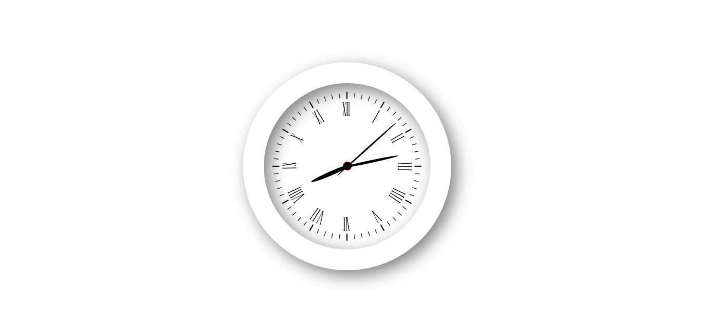
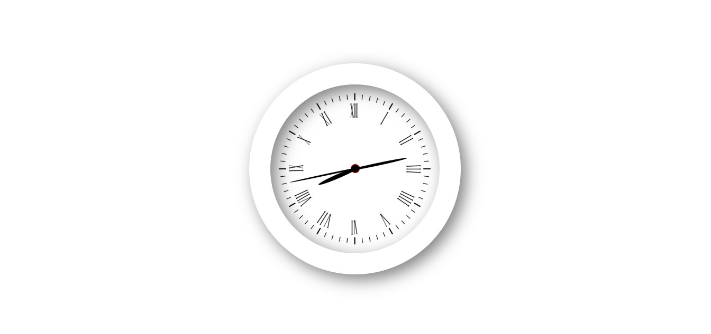

# Analog Clock

I created a mini-project: an analog clock using HTML, CSS, and JavaScript. In JavaScript, I used the Date object to get the current time (hours, minutes, and seconds) and used the setInterval method to rotate the clock hands continuously.

 
